# Guia de Arquitetura do Editor de Fluxo

## 1. Visão Geral do Sistema

O Editor de Fluxo é uma ferramenta de programação visual construída sobre o ReactFlow, permitindo que usuários criem, conectem e configurem blocos em uma interface baseada em nós. Diferente de codificação tradicional, essa abordagem visual facilita a criação de lógicas complexas através de conexões entre blocos funcionais.

O sistema consiste em vários componentes-chave que trabalham juntos:

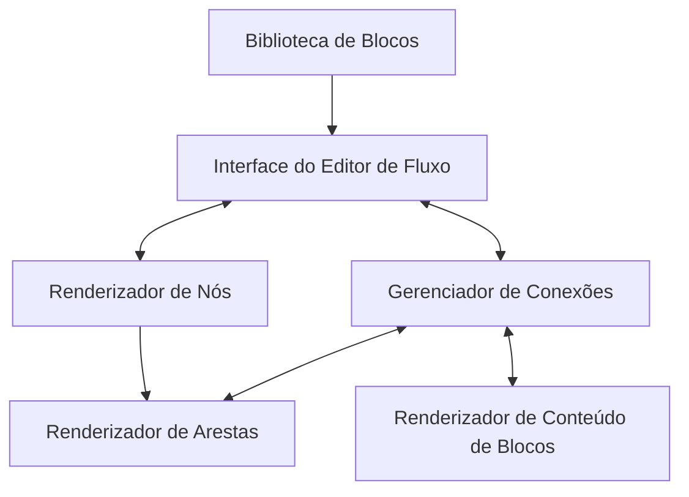

**Para desenvolvedores iniciantes:** Pense no Editor de Fluxo como um quebra-cabeça onde cada peça (bloco) tem uma função específica. Você conecta essas peças para criar um fluxo de trabalho. A Biblioteca de Blocos fornece as peças disponíveis, a Interface permite arrastá-las e conectá-las, e os renderizadores são responsáveis por mostrar tudo na tela.

## 2. Integração com ReactFlow

O editor é construído sobre o ReactFlow, uma biblioteca popular para criar editores de fluxo interativos. O ReactFlow fornece a tela, os nós, as arestas e a lógica de interação, enquanto nosso código personaliza e estende essas funcionalidades.

### Principais Componentes do ReactFlow Utilizados:

- `ReactFlow`: Componente principal que renderiza a tela
- `useNodesState`/`useEdgesState`: Hooks para gerenciar os estados dos nós e arestas
- `useReactFlow`: Hook para acessar métodos da instância do ReactFlow
- Renderizadores personalizados de nós e arestas

**Para desenvolvedores iniciantes:** Os hooks são funções especiais do React que permitem gerenciar o estado e efeitos. `useNodesState` e `useEdgesState` são hooks personalizados fornecidos pelo ReactFlow que facilitam o gerenciamento dos nós e conexões no fluxo.

### Configuração Principal do ReactFlow em Flow.js:

```javascript
<ReactFlow
  nodes={nodes}
  edges={edges}
  onNodesChange={onNodesChange}
  onEdgesChange={onEdgesChange}
  onConnect={onConnect}
  nodeTypes={nodeTypes}
  edgeTypes={edgeTypes}
  defaultEdgeOptions={{...}}
  onDrop={onDrop}
  onDragOver={...}
>
  <Background />
  <Controls />
  {/* Menus de contexto, etc. */}
</ReactFlow>
```

**Explicando o código acima:**
- `nodes` e `edges`: São arrays contendo todos os nós e conexões do fluxo
- `onNodesChange`/`onEdgesChange`: Funções chamadas quando há alterações nos nós/arestas
- `onConnect`: Função chamada quando uma nova conexão é criada
- `nodeTypes`/`edgeTypes`: Objetos que mapeiam tipos de nós/arestas para componentes personalizados
- `Background`: Componente que adiciona um fundo quadriculado à área de trabalho
- `Controls`: Adiciona controles de zoom e centralização

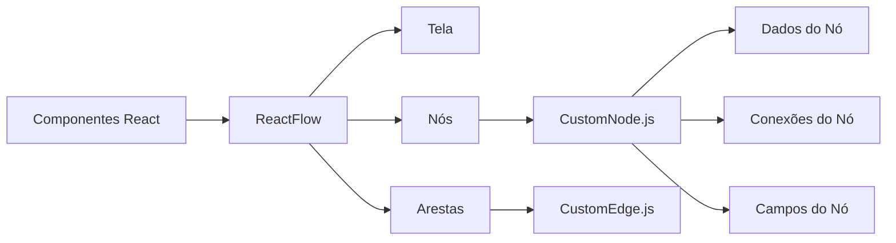

## 3. Arquitetura do Sistema de Blocos

### Registro de Blocos

O sistema de blocos utiliza um padrão de registro para gerenciar os blocos disponíveis. Isso permite fácil extensibilidade e manutenção centralizada dos tipos de blocos.

```javascript
// lib/blocks/registry.js
import { BlockLibrary, BlockTypes } from './library';

export { BlockTypes };

export function getBlock(type) {
  return BlockLibrary[type];
}

export function getAllBlocks() {
  return Object.values(BlockLibrary);
}
```

**Para desenvolvedores iniciantes:** Este padrão de registro funciona como um catálogo de todos os blocos disponíveis. A função `getBlock` busca um tipo específico de bloco, enquanto `getAllBlocks` retorna todos os blocos disponíveis. Este sistema facilita adicionar novos tipos de blocos sem alterar o código em múltiplos lugares.

### Estrutura de Definição de Blocos

Cada bloco possui uma estrutura de definição padronizada. Esta consistência torna o sistema mais previsível e facilita a adição de novos tipos de blocos.

```javascript
{
  type: 'api_request',          // Identificador único
  label: 'Requisição API',      // Nome de exibição
  category: BlockCategories.API, // Categoria para organização
  icon: 'solar:api-bold',       // Ícone para identificação visual
  color: 'primary',             // Tema de cor da UI
  connections: {
    input: 1,                  // Número de entradas permitidas (0 para blocos iniciais)
    output: {                  // Definição de saída
      type: ConnectionTypes.INTEGRATION,
      outputs: {
        success: { maxConnections: 1 },
        error: { maxConnections: 1 }
      }
    }
  },
  fields: [                    // Campos da UI para configuração do bloco
    {
      key: 'url',
      type: FieldTypes.TEXT,
      label: 'URL',
      defaultValue: '',
      required: true
    },
    // Mais campos...
  ],
  defaultData: {               // Valores de estado padrão
    method: 'GET',
    url: '',
    headers: [],
    body: ''
  }
}
```

**Explicação detalhada:**
- `type`: Identificador único usado internamente
- `label`: Nome amigável exibido na interface
- `category`: Agrupa blocos similares no seletor de blocos
- `connections`: Define como o bloco pode se conectar a outros
  - `input`: Quantas conexões podem entrar no bloco
  - `output`: Como as conexões saem do bloco (tipo e quantidade)
- `fields`: Define quais campos de configuração aparecerão no bloco
- `defaultData`: Valores iniciais para os dados do bloco

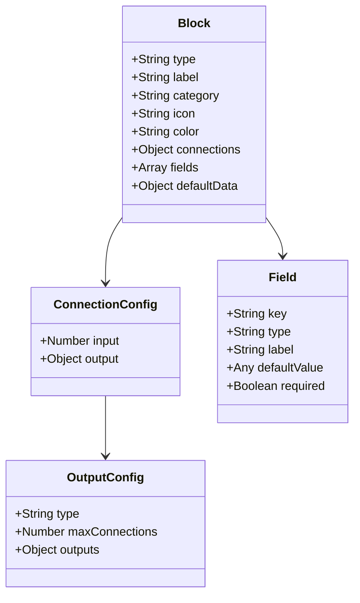

## 4. Implementação de Nós Personalizados

O componente `CustomNode.js` renderiza blocos individuais com extensa personalização. Cada nó é uma representação visual de um bloco, com interfaces para configuração e conexão.

### Estrutura do Nó

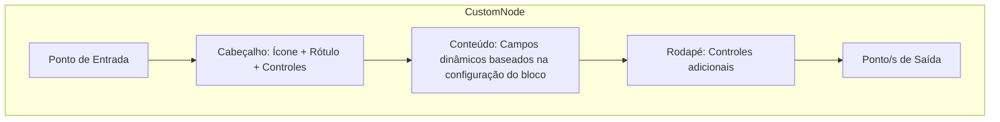

**Para desenvolvedores iniciantes:** Cada nó no editor de fluxo é um componente React que segue esta estrutura. Os pontos de entrada/saída (handles) são onde as conexões podem ser feitas. O conteúdo muda dinamicamente com base no tipo de bloco.

### Componentes-Chave:

1. **Pontos de Entrada/Saída (Handles)**: Permitem conexões entre blocos
   ```javascript
   <Handle
     type="source"
     position={Position.Right}
     id="success"
     isConnectable={isConnectable}
     className="..."
   />
   ```
   
   **Explicação:** O componente `Handle` do ReactFlow cria um ponto de conexão. `type="source"` significa que é um ponto de saída (de onde sai a conexão). Para pontos de entrada, usamos `type="target"`.

2. **BlockContent**: Renderiza a interface dinâmica baseada no tipo de bloco
   ```javascript
   <BlockContent 
     fields={blockConfig?.fields}
     data={localData}
     onDataChange={handleDataChange}
     nodeId={id}
   />
   ```
   
   **Explicação:** Este componente recebe a configuração de campos do bloco e os dados atuais, renderizando a interface apropriada para o usuário configurar o bloco.

3. **Pontos de Saída Dinâmicos**: Gerados com base no tipo de conexão
   ```javascript
   // Os pontos são renderizados diferentemente com base em outputConfig.type:
   // - ConnectionTypes.DEFAULT: Ponto único
   // - ConnectionTypes.NUMBERED: Múltiplas saídas numeradas
   // - ConnectionTypes.INTEGRATION: Saídas de sucesso/erro
   // - ConnectionTypes.CONDITIONAL: Saídas baseadas em condições
   ```
   
   **Exemplo Prático:** Um bloco de requisição API tem saídas diferentes para "sucesso" e "erro", enquanto um bloco de navegação pode ter múltiplas saídas numeradas, uma para cada botão.

## 5. Gerenciamento de Conexões

### Tipos de Conexão

As conexões entre blocos seguem diferentes padrões, dependendo da funcionalidade do bloco:

```javascript
// lib/blocks/types.js
export const ConnectionTypes = {
  DEFAULT: 'default',       // Saída única
  NUMBERED: 'numbered',     // Múltiplas saídas numeradas
  INTEGRATION: 'integration', // Saídas de sucesso/erro
  CONDITIONAL: 'conditional'  // Roteamento condicional
};
```

**Para desenvolvedores iniciantes:** 
- `DEFAULT`: Blocos simples com apenas uma saída possível (ex: bloco de mensagem)
- `NUMBERED`: Blocos com múltiplas saídas numeradas (ex: bloco de navegação com botões)
- `INTEGRATION`: Blocos com caminhos separados para sucesso e erro (ex: requisição API)
- `CONDITIONAL`: Blocos que avaliam condições e roteiam baseado em resultados

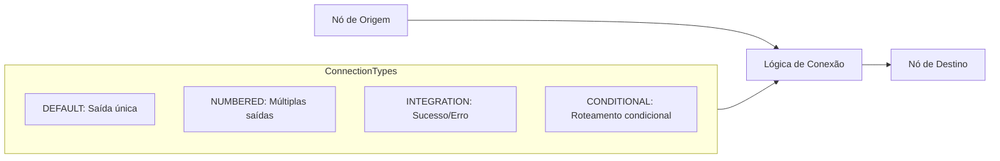

### Validação de Conexões

As conexões são validadas através da função `validateConnection`:

```javascript
// lib/blocks/connections.js
export function validateConnection(connection, sourceNode, targetNode, edges) {
  // Verifica se os nós existem
  // Verifica a configuração de conexão
  // Valida com base no tipo de conexão
  // Verifica conexões existentes
  return { isValid: true|false, message: '...' };
}
```

**Explicação detalhada:** A validação de conexões garante que:
1. Não exceda o número máximo de conexões permitidas
2. Blocos compatíveis sejam conectados
3. Não haja conexões redundantes
4. Regras específicas de cada tipo de conexão sejam seguidas

Por exemplo, em um bloco DEFAULT, só podemos ter uma única conexão de saída. Para blocos INTEGRATION, podemos ter uma conexão para o caminho de sucesso e uma para o caminho de erro.

## 6. Conteúdo do Bloco e Campos

O componente `BlockContent.js` renderiza dinamicamente a interface com base na configuração do bloco:

### Tipos de Campos

```javascript
export const FieldTypes = {
  TEXT: 'text',               // Campo de texto simples
  TEXTAREA: 'textarea',       // Área de texto multilinha
  NUMBER: 'number',           // Campo numérico
  SELECT: 'select',           // Dropdown de seleção
  BUTTONS: 'buttons',         // Campo de botões
  ROUTES: 'routes',           // Campo de rotas
  HEADERS: 'headers',         // Campo de cabeçalhos HTTP
  BODY: 'body',               // Campo de corpo de requisição
  MESSAGE: 'message',         // Campo de mensagem
  CONDITIONS: 'conditions',   // Campo de condições
  QUERY: 'query',             // Campo de consulta
  INTERACT_DATA: 'interact_data', // Campo de interação de dados
  CHECKLIST: 'checklist',     // Campo de checklist
  VARIABLE_INPUT: 'variable_input' // Campo com suporte a variáveis
};
```

**Para desenvolvedores iniciantes:** Cada tipo de campo representa um componente de entrada específico que aparecerá no bloco. Por exemplo, TEXT renderiza um input de texto simples, enquanto HEADERS renderiza um editor especializado para cabeçalhos HTTP.

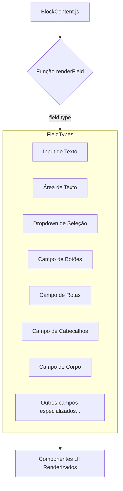

### Lógica de Renderização de Campos

```javascript
// Em BlockContent.js
const renderField = (field) => {
  switch (field.type) {
    case FieldTypes.TEXT:
      // Renderiza input de texto
    case FieldTypes.SELECT:
      // Renderiza dropdown de seleção
    // etc. para todos os tipos de campos
  }
};
```

**Explicação prática:** Quando o editor precisa mostrar um bloco, ele usa essa função para determinar quais componentes de interface renderizar. Por exemplo, se o bloco tem um campo de tipo TEXT, a função retornará um componente `<Input />` com as propriedades apropriadas.

## 7. Sistema de Variáveis

Uma funcionalidade poderosa do editor é o sistema de variáveis, que permite que blocos compartilhem dados entre si.

### Estrutura de Variáveis

```javascript
{
  name: 'respostaAPI',
  type: 'object',
  structure: {
    type: 'object',
    isExpandable: true,
    properties: {
      // Estrutura analisada dos dados
    }
  }
}
```

**Para desenvolvedores iniciantes:** As variáveis permitem que dados sejam passados entre blocos. Por exemplo, um bloco de requisição API pode gerar uma variável contendo a resposta, que pode ser usada por blocos subsequentes.

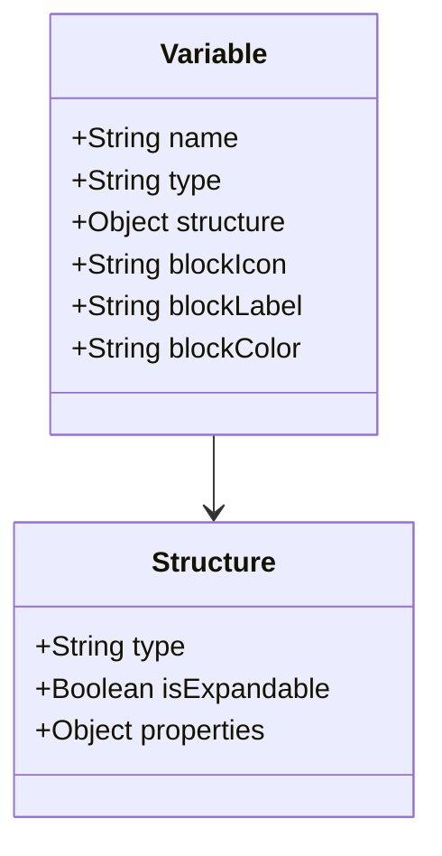

### Propagação de Variáveis

O sistema analisa o fluxo para determinar quais variáveis estão disponíveis:

```javascript
const getAvailableVariables = (nodes, currentNodeId) => {
  // 1. Encontra todos os nós anteriores (nós que vêm antes deste)
  // 2. Extrai variáveis desses nós
  // 3. Retorna lista formatada de variáveis com metadados
};
```

**Explicação do processo:**
1. O sistema identifica todos os blocos que aparecem antes do bloco atual no fluxo
2. Para cada bloco anterior, extrai as variáveis que ele produz
3. Cria uma lista de todas as variáveis disponíveis para o bloco atual usar

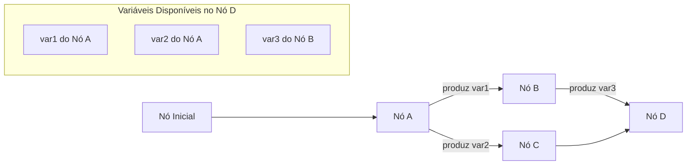

### Sugestões de Variáveis

O componente `VariableSuggestionsModal` oferece uma interface inteligente de sugestão:

```javascript
// Quando o usuário digita $ em um campo de texto:
if (value.endsWith('$')) {
  openModal(availableVariables, (variable) => {
    // Substitui o $ pela expressão de variável
    const newValue = value.slice(0, -1) + '${' + variable.name + '}';
    onChange(newValue);
  });
}
```

**Exemplo prático:** Quando o usuário está editando um campo e digita o caractere `$`, um modal aparece mostrando todas as variáveis disponíveis. Ao selecionar uma variável, ela é inserida no formato `${nomeDaVariavel}`, que será substituído pelo valor real durante a execução.

## 8. Manipulação e Personalização de Arestas

O componente `CustomEdge.js` fornece uma aresta visualmente aprimorada:

```javascript
<g onMouseEnter={() => setIsHovered(true)} onMouseLeave={() => setIsHovered(false)}>
  {/* Caminho invisível mais largo para melhor detecção de hover */}
  <path d={edgePath} strokeWidth={20} fill="none" stroke="transparent" />
  
  {/* Caminho visível da aresta */}
  <BaseEdge 
    path={edgePath} 
    markerEnd={markerEnd} 
    style={{...}}
  />

  {/* Botão de exclusão que aparece ao passar o mouse */}
  {isHovered && (
    <EdgeLabelRenderer>
      <Button onPress={handleEdgeDelete}>...</Button>
    </EdgeLabelRenderer>
  )}
</g>
```

**Para desenvolvedores iniciantes:**
- As arestas são as linhas que conectam os blocos
- Usamos dois caminhos: um invisível mais largo para facilitar a interação e um visível para a aparência
- Quando o mouse passa sobre a aresta, um botão de exclusão aparece

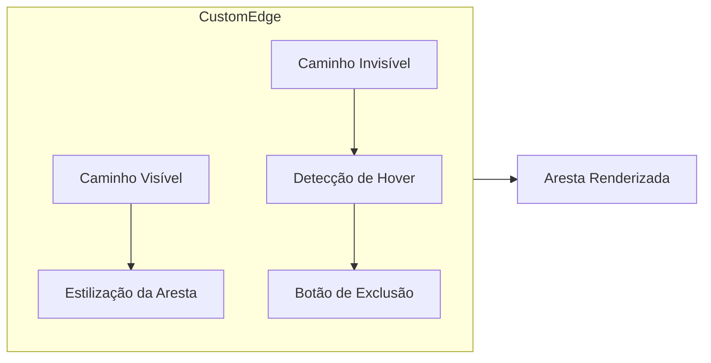

## 9. Barra de Ferramentas de Blocos e Ações do Usuário

O componente `BlockToolbar.js` fornece as principais ações do usuário:

```javascript
<Dock>
  {/* Botão de adicionar bloco */}
  <DockIcon onClick={() => setIsBlockModalOpen(true)}>...</DockIcon>
  
  {/* Botão de alinhamento automático */}
  <DockIcon onClick={handleAutoAlign}>...</DockIcon>
  
  {/* Botão de salvar fluxo */}
  <DockIcon onClick={onSave}>...</DockIcon>
  
  {/* Botão de alternar tema */}
  <DockIcon onClick={toggleTheme}>...</DockIcon>
</Dock>
```

**Funcionalidades principais:**
- **Adicionar Bloco**: Abre o modal da biblioteca de blocos para adicionar novos blocos
- **Alinhamento Automático**: Organiza os nós para melhor visualização
- **Salvar Fluxo**: Salva o estado atual do fluxo
- **Alternar Tema**: Alterna entre os temas claro e escuro

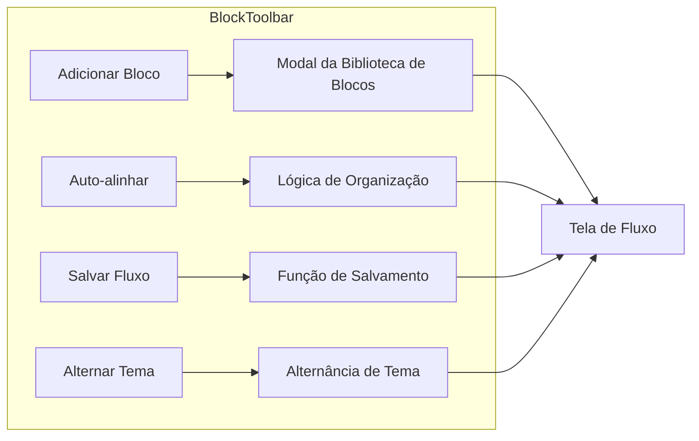

## 10. Guia de Implementação para Desenvolvedores

### Criando um Novo Tipo de Bloco

1. **Defina o bloco na BlockLibrary**:
   ```javascript
   const NovoBloco = {
     type: 'meu_bloco_personalizado',
     label: 'Meu Bloco Personalizado',
     category: BlockCategories.CUSTOM,
     icon: 'solar:custom-icon',
     color: 'primary',
     connections: {
       input: 1,
       output: {
         type: ConnectionTypes.DEFAULT,
         maxConnections: 1
       }
     },
     fields: [
       // Definições de campos
     ],
     defaultData: {
       // Valores padrão
     }
   };
   
   // Adicione à BlockLibrary
   export const BlockLibrary = {
     // ...blocos existentes
     [NovoBloco.type]: NovoBloco
   };
   ```

2. **Implemente renderizadores de campos personalizados** se necessário em BlockContent.js

3. **Adicione lógica de validação especial** se necessário no sistema de validação de conexões

**Para desenvolvedores iniciantes:**
- Primeiro defina a estrutura do bloco no arquivo de biblioteca
- Os campos determinam o que o usuário pode configurar
- Se o bloco tem comportamento especial, você pode precisar adicionar lógica de validação personalizada

### Estendendo o Editor de Fluxo

1. **Crie novos tipos de campos** estendendo FieldTypes e adicionando renderizador em BlockContent

2. **Adicione novos tipos de conexão** estendendo ConnectionTypes e atualizando a lógica de validação

3. **Aprimore interações de nós** modificando o componente CustomNode

4. **Adicione novas ações à barra de ferramentas** estendendo o componente BlockToolbar

**Passo a passo para estender o editor:**
1. Identifique onde a nova funcionalidade se encaixa (tipo de campo, conexão, etc.)
2. Adicione a definição da nova funcionalidade no arquivo apropriado
3. Implemente a lógica de renderização ou comportamento
4. Teste a implementação no editor

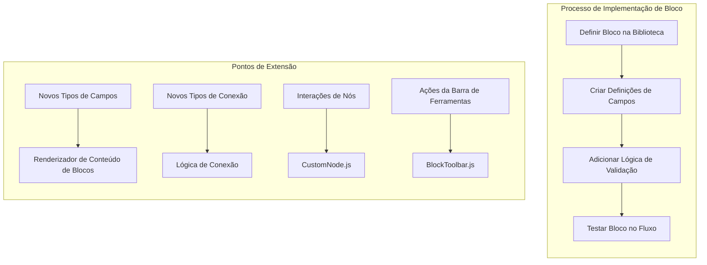

## 11. Fluxo de Dados e Gerenciamento de Estado

O fluxo de dados no editor segue um padrão unidirecional, onde ações do usuário atualizam o estado React, que por sua vez atualiza a visualização do ReactFlow.

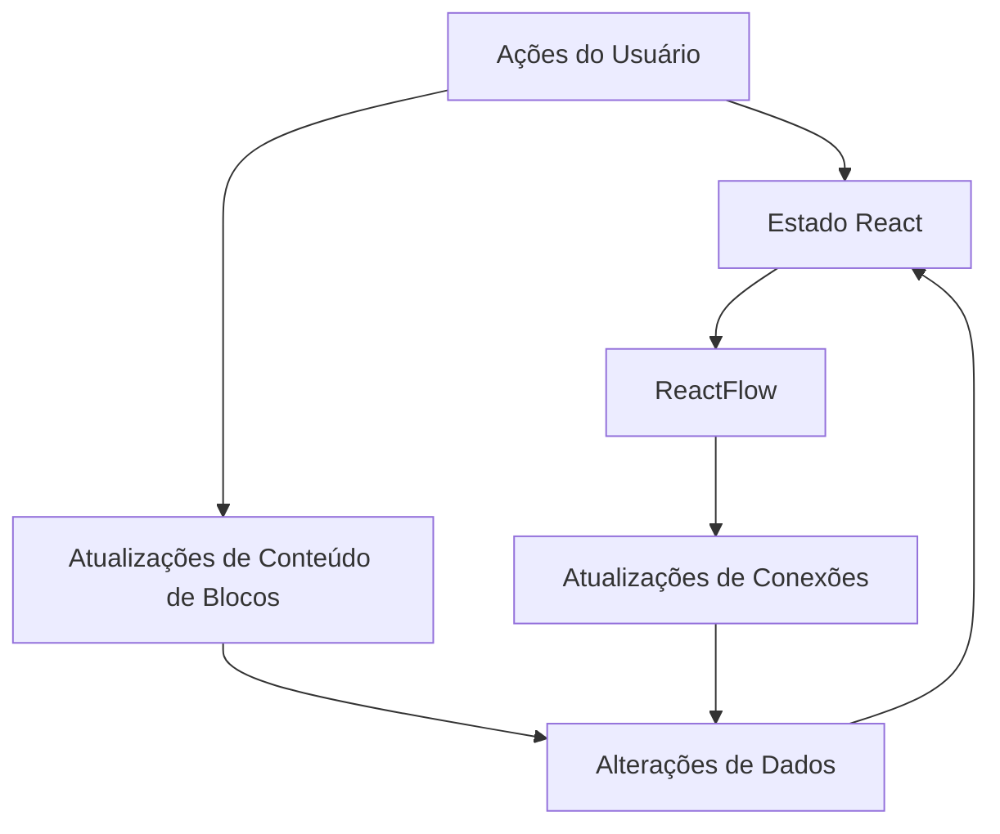

**Para desenvolvedores iniciantes:**
1. O usuário interage com a interface (arrasta nós, edita campos, cria conexões)
2. Essas interações atualizam o estado React (usando hooks como useState e useReducer)
3. As mudanças de estado são refletidas na visualização do ReactFlow
4. O ReactFlow também pode gerar eventos (como conexões criadas) que atualizam o estado

## 12. Persistência de Dados e Processo de Salvamento

### Estrutura de Dados do Fluxo

Ao salvar um fluxo, precisamos garantir que ele seja serializável e possa ser restaurado adequadamente posteriormente. A estrutura de dados do fluxo se parece com isto:

```javascript
{
  nodes: [
    {
      id: 'start',
      type: 'customNode',
      position: { x: 100, y: 200 },
      data: {
        blockType: 'start',
        label: 'Início',
        // Nota: a função onChange é removida antes de salvar
        // Outros dados específicos do bloco...
      }
    },
    // Mais nós...
  ],
  edges: [
    {
      id: 'start-node1',
      source: 'start',
      target: 'node1',
      type: 'default'
    },
    // Mais arestas...
  ]
}
```

**Observações importantes para iniciantes:**
- Funções (como `onChange`) não podem ser serializadas para JSON e devem ser removidas antes de salvar
- Ao carregar, precisamos recriar essas funções e reattachá-las aos nós
- Cada nó mantém sua própria configuração no objeto `data`
- As arestas contêm informações sobre quais nós estão conectados

### Fluxo de Salvamento

O processo de salvamento envolve várias etapas-chave:

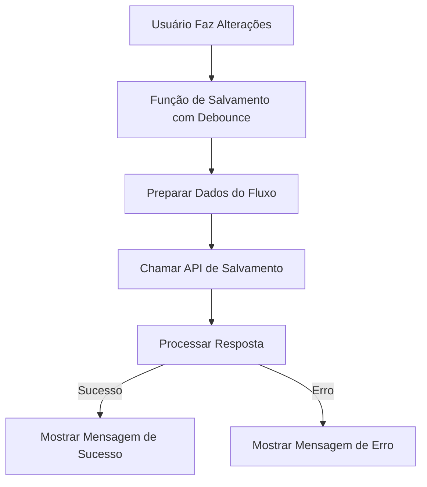

1. **Acionando um salvamento**: Os salvamentos podem ser acionados automaticamente em alterações ou manualmente através do botão de salvar
2. **Salvamento com debounce**: Para evitar chamadas excessivas à API, os salvamentos são executados com debounce
3. **Preparação de dados**: Antes de salvar, funções como `onChange` são removidas dos dados do nó
4. **Chamada de API**: Os dados preparados são enviados para o backend
5. **Processamento de resposta**: Estados de sucesso ou erro são gerenciados e comunicados ao usuário

### Implementação de Salvamento com Debounce

O mecanismo de salvamento usa debounce para evitar chamadas excessivas à API:

```javascript
// Otimiza saveFlow com debounce e estado de carregamento
const saveFlow = useMemo(() => {
  let timeoutId;
  
  return async () => {
    if (!projectId) return;

    // Limpa qualquer salvamento pendente
    if (timeoutId) clearTimeout(timeoutId);

    // Operação de salvamento com debounce
    timeoutId = setTimeout(async () => {
      setIsSaving(true);
      try {
        const response = await fetch(`/api/projects/${projectId}/save`, {
          method: 'POST',
          headers: {
            'Content-Type': 'application/json',
          },
          body: JSON.stringify({
            nodes,
            edges,
          }),
        });

        if (!response.ok) {
          const error = await response.json();
          throw new Error(error.message || 'Falha ao salvar fluxo');
        }

        toast.success('Fluxo salvo com sucesso');
      } catch (error) {
        console.error('Erro ao salvar fluxo:', error);
        toast.error('Falha ao salvar fluxo: ' + error.message);
      } finally {
        setIsSaving(false);
      }
    }, 1000); // Debounce por 1 segundo
  };
}, [projectId, nodes, edges]);
```

**Explicação para iniciantes:**
- **Debounce**: Essa técnica espera que o usuário pare de fazer alterações por um período (1 segundo) antes de realmente fazer o salvamento, evitando múltiplas chamadas à API durante edições rápidas
- **Memoização**: A função é envolvida em `useMemo` para garantir que a mesma referência de função seja mantida entre renderizações, a menos que as dependências mudem
- **Estado de carregamento**: O estado `isSaving` é usado para mostrar feedback visual durante o salvamento
- **Tratamento de erros**: Erros são capturados e exibidos para o usuário

### Carregando Fluxos Salvos

Ao carregar um fluxo previamente salvo, precisamos reattachar os manipuladores de eventos e restaurar o estado interativo:

```javascript
// Dentro do useEffect que monitora os dados do projeto
if (docSnapshot.exists()) {
  const data = docSnapshot.data();
  
  if (data.flow) {
    // Adiciona manipuladores onChange aos nós existentes
    const nodesWithHandlers = data.flow.nodes.map(node => {
      const blockConfig = BlockLibrary[node.data.blockType];
      return {
        ...node,
        draggable: node.data.blockType !== BlockTypes.START,
        data: {
          ...node.data,
          delay: node.data.delay || 0,
          label: blockConfig?.label || node.data.label,
          onChange: (newData) => handleNodeChange(node.id, newData),
        },
      };
    });
    
    setNodes(nodesWithHandlers);
    setEdges(data.flow.edges || []);
  }
}
```

**Pontos importantes para iniciantes:**
1. Lemos os dados do documento do Firestore
2. Para cada nó no fluxo salvo:
   - Buscamos sua configuração na biblioteca de blocos
   - Recriamos a função `onChange` para permitir edição
   - Configuramos propriedades como `draggable` (se pode ser arrastado)
3. Definimos os nós e arestas no estado do ReactFlow

### Auto-Save vs. Salvamento Manual

O editor de fluxo suporta tanto salvamento automático quanto manual:

1. **Auto-save**: Alterações em nós e arestas acionam a função de salvamento com debounce
2. **Salvamento manual**: O botão de salvar na barra de ferramentas permite salvamento explícito

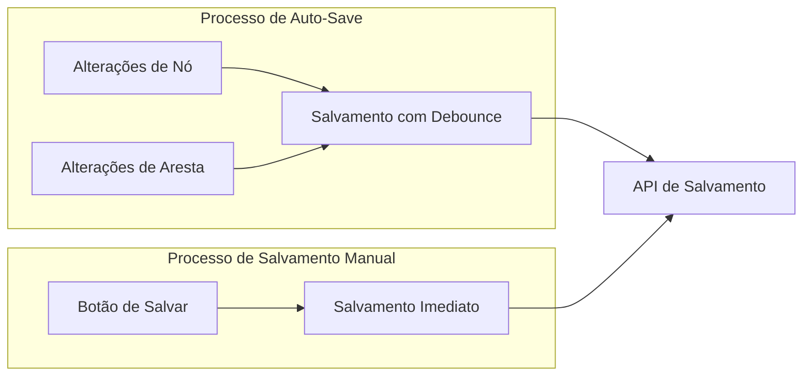

### Tratamento de Erros e Feedback

O processo de salvamento inclui tratamento de erros e feedback ao usuário:

1. **Indicador de carregamento**: O botão de salvar mostra um spinner durante o salvamento
2. **Feedback de sucesso**: Notificações toast para salvamentos bem-sucedidos
3. **Tratamento de erros**: Salvamentos falhos mostram mensagens de erro com detalhes
4. **Lógica de tentativa**: Os usuários podem tentar manualmente salvar novamente se o auto-save falhar

**Benefícios para desenvolvedores:**
- O usuário sempre sabe quando o salvamento está acontecendo ou se houve algum erro
- As tentativas automáticas não bloqueiam a interface
- O salvamento manual oferece controle quando necessário 
